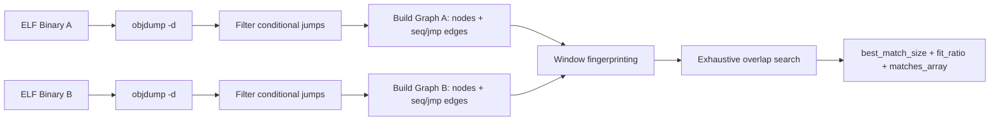
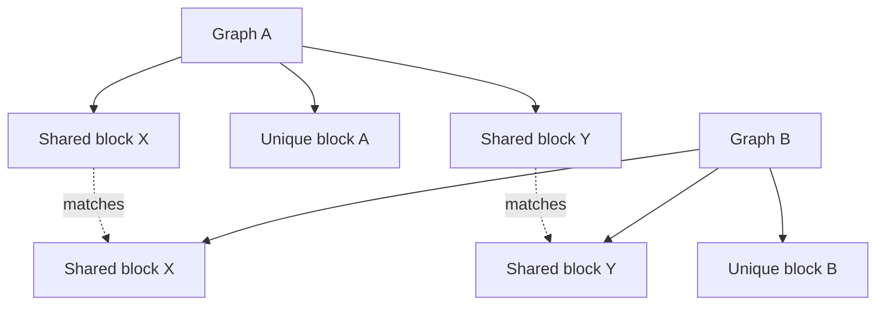

# Binary Subgraph Fingerprinting for Malware Triage

Quick start: [docs/quickstart.md](docs/quickstart.md)

License: MIT (see [LICENSE](LICENSE))

This project helps malware analysts quickly answer:

"Do these two ELF binaries share meaningful control-flow structure, even if they are not identical files?"

It does this by building a **conditional-jump graph fingerprint** from disassembly, then searching for **shared subgraphs** (none, one, or many).

## Why this helps in malware analysis

When binaries are recompiled, relinked, packed differently, or partially modified, hash/signature matching often fails. But shared logic frequently preserves branch structure.

This tool gives a fast structural signal for:
- Family resemblance across variants
- Reused routines across droppers/loaders/plugins
- Partial code theft / borrowed algorithm blocks
- Prioritizing deep reverse engineering targets

It is not a full semantic equivalence engine; it is a practical **graph-based triage fingerprint**.

## Core idea

From `objdump -d` output, keep only conditional branches (`j*` excluding unconditional `jmp`, plus loop-style conditional opcodes), then build a directed graph:
- `seq` edge: jump-node `i -> i+1` in observed order
- `jmp` edge: jump-node `i -> target-node` if target is also in the jump-node set

Then compare two graphs by exhaustive contiguous window matching.

## Pipeline diagram



## Multiple graph isomorphism (plural matches)

The tool supports two comparison modes:

1. **Best-size mode (default)**
   - Finds the largest shared window size
   - Reports matches at that best size

2. **All-sizes mode** (`--collect-all-sizes`)
   - Continues scanning down to `--min-size`
   - Reports many shared windows across sizes
   - Optional `--size-filter N` narrows output to exactly size `N`

Conceptually:



That is why this is useful for **partial overlap** in malware lineages.

## Requirements

- Linux
- Python 3.10+
- `objdump` in `PATH` (from `binutils`)
- `gcc` (only needed for local C example builders)

## CLI quick reference

### Extract graph

```bash
python3 graph_iso.py extract \
  --binary /path/to/sample_a.elf \
  --output /path/to/sample_a.graph.json
```

### Compare against prior graph (default best-size)

```bash
python3 graph_iso.py compare \
  --binary /path/to/sample_b.elf \
  --prior-graph /path/to/sample_a.graph.json \
  --output /path/to/compare.json \
  --extracted-output /path/to/sample_b.graph.json
```

### Compare with plural matches across sizes

```bash
python3 graph_iso.py compare \
  --binary /path/to/sample_b.elf \
  --prior-graph /path/to/sample_a.graph.json \
  --output /path/to/compare.json \
  --collect-all-sizes \
  --min-size 4 \
  --max-report 200
```

### Compare with exact size filter

```bash
python3 graph_iso.py compare \
  --binary /path/to/sample_b.elf \
  --prior-graph /path/to/sample_a.graph.json \
  --output /path/to/compare.json \
  --collect-all-sizes \
  --min-size 4 \
  --size-filter 12 \
  --max-report 200
```

## Output interpretation (analyst view)

Comparison JSON includes:
- `best_match_size`: largest shared window
- `fit_ratio_against_min_nodes`: ratio computed as `best_match_size / min(prior_node_count, new_node_count)`
- `match_count_reported`: number of reported matches
- `matches[]`: entries like `{ prior_start, new_start, size }`

Practical read:
- **High ratio + many matches**: likely strong structural similarity / shared code
- **High ratio + few matches**: one dominant shared routine
- **Low ratio + few matches**: weak/limited overlap
- **Non-zero with meaningful size**: candidate reused subroutine worth reversing

## Included walkthroughs

### 1) Small sanity check

```bash
./test-run.sh
```

Defaults: `/bin/true` vs `/bin/false` (fast, often high overlap).

### 2) Different-size real binaries

```bash
./test-run-miss.sh
```

Defaults: `/bin/true` vs `/bin/ls` (typically lower overlap).

### 3) Controlled partial overlap (2 of 3 functions)

```bash
./test-run-examples.sh
```

Builds `examples/src/prog_a.c` and `examples/src/prog_b.c`.

### 4) Controlled plural matching demo

```bash
./test-run-examples-multi.sh
```

Builds repeated-shared-structure samples and reports multiple matches.

Filter to one size only:

```bash
./test-run-examples-multi.sh 14
```

## Suggested malware triage workflow

1. Build a baseline graph library from known samples (`extract`).
2. For each new sample, run `compare` against relevant family baselines.
3. Rank by `fit_ratio_against_min_nodes` and `best_match_size`.
4. Inspect top `matches[]` windows to focus RE effort.
5. Re-run with `--collect-all-sizes` and `--size-filter` to map shared blocks.

## Limitations and caveats

- This is a **fingerprint**, not complete CFG recovery.
- It currently focuses on conditional jumps only; some semantics are intentionally ignored.
- Compiler flags, optimization, and obfuscation can alter branch layout.
- Large binaries can be expensive in exhaustive mode; use `--min-size`, `--size-filter`, and `--max-report` to bound output/time.

## Ethical and legal note

Use this for authorized malware analysis, incident response, and defensive research in environments where you have legal permission to inspect binaries.

## Attribution

- Theory and concept direction: **Timeless Prototype**
- Code implementation: **GitHub Copilot (GPT-5.3-Codex)**
- License: **MIT**